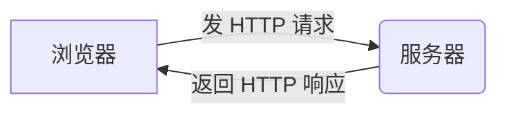

# Day01 — HTTP 基础与 XHR 实战分析（爬虫学习笔记）

**目标**：理解浏览器与服务器的通信方式，并掌握如何在 Network 面板中找到真实数据接口（XHR/Fetch）。

本日学习内容是整个爬虫系统的基础能力。

## 1\. HTTP 基础概念

### ✔ 1.1 浏览器与服务器的交互模型

网页加载过程本质上是：



**爬虫要做的，就是用 Python 模拟浏览器发送同样的请求。**

### ✔ 1.2 HTTP 请求（Request）组成

一个请求包含以下核心部分（浏览器 $\leftrightarrow$ Python `requests` 之间完全等价）：

  * **URL**：访问地址
  * **Method**：`GET` / `POST`
  * **Headers**：用户身份、浏览器属性等（`User-Agent` / `Cookie` / `Referer`）
  * **Query Params**：URL 参数
  * **Body**（仅 POST）：表单、JSON 等

### ✔ 1.3 HTTP 响应（Response）组成

  * **状态码 (Status Code)**：
      * `200`：成功
      * `302`：重定向（常见于登录跳转）
      * `403`：禁止访问（通常是反爬虫拦截）
      * `404`：资源不存在
      * `429`：访问频率过高
      * `500`：服务器错误
  * **响应头 (Response Headers)**
  * **响应体 (Response Body)**：HTML / JSON / 图片等
      * *注：爬虫最关心的是响应体是否是 JSON。*

-----

## 2\. HTML 与 XHR 的区别（爬虫核心）

### ✔ 2.1 HTML 是“页面结构”

HTML 返回的内容通常包含标签、样式、结构和展示内容。

  * **示例**：
    ```html
    <div class="article">...</div>
    ```
  * **缺点**：解析麻烦、数据提取不稳定、容易因网站改版而失效。

### ✔ 2.2 XHR / Fetch 是“真实数据接口”

XHR（XMLHttpRequest）与 Fetch 返回的是 **结构化数据**，通常为 JSON。这是页面实际渲染数据的来源，也是爬虫的主要目标。

  * **示例**：
    ```json
    {
      "data": [...],
      "cursor": "20"
    }
    ```

### ✔ 2.3 如何理解它们的关系？

  * **XHR** 是最早的异步请求方式。
  * **AJAX** 是使用 XHR 实现异步的技术理念（不是 API）。
  * **Fetch** 是现代替代品，语法更简洁。
  * **对爬虫来说**：XHR 和 Fetch 生成的请求没有区别，都是普通 HTTP 请求。

-----

## 3\. 如何在 DevTools 中识别数据接口

### ✔ 3.1 操作步骤

1.  打开网页
2.  按 **F12** 打开开发者工具 → 点击 **Network** 面板
3.  刷新页面
4.  过滤器切换到 **Fetch/XHR**
5.  找到返回 JSON 的请求

### ✔ 3.2 判断标准

一个请求是“数据接口”，通常满足以下特征：

  * 响应内容（Response）是 **JSON** 格式
  * URL 中带有 `list`, `feed`, `search`, `query`, `page` 等关键词
  * 多半由滚动、搜索、点击切换等动作触发
  * 可直接用 Python 调用并获取数据

-----

## 4\. Fetch 与 XHR 的区别（Network 面板视角）

### ✔ 4.1 XHR 请求特征

Header 中常见：

```http
X-Requested-With: XMLHttpRequest
```

### ✔ 4.2 Fetch 请求特征

会自动带上浏览器安全头：

```http
Sec-Fetch-Mode: cors
Sec-Fetch-Site: same-site
Sec-Fetch-Dest: empty
```

### ✔ 4.3 实战意义

**不必区分 Fetch / XHR**，它们最终都是普通的 HTTP 数据请求，Python 模拟时方法一致。

-----

## 5\. Cookie 与鉴权（Day01 必须理解）

### ✔ 5.1 Cookie 是什么？

Cookie = 服务器给你的身份令牌（Session / Token）。
浏览器下一次访问时会自动带上 Cookie，服务器据此判断你是否登录。

### ✔ 5.2 判断一个接口是否需要 Cookie

如果满足以下条件，则通常 **不需要 Cookie**：

1.  未登录也能访问
2.  无关用户隐私
3.  属于公开数据（如搜索结果）

> **验证结论**：CSDN、掘金等网站的搜索接口通常属于公共接口，无需 Cookie。

-----

## 6\. 实战示例：掘金搜索接口

你成功抓包并分析了掘金的搜索接口：

**接口地址**：

```text
https://api.juejin.cn/search_api/v1/search
```

**关键参数分析**：

| 参数名 | 含义 | 备注 |
| :--- | :--- | :--- |
| `query` | 搜索关键词 | 核心参数 |
| `cursor` | 游标 | 用于控制分页 |
| `limit` | 每页条数 | 控制数据量 |
| `id_type` / `search_type` | 搜索类型 | 通常固定 |
| `uuid` / `aid` | 浏览器标识 | 多数情况下无需伪造 |

**结论**：

  * **返回 JSON** → 确实是数据接口
  * **无需 Cookie** → 属于公共搜索
  * **Result** → 可以直接用 Python `requests` 库进行请求

这是 Day01 最重要的实践成果。

-----

## 7\. Day01 能力总结

你已经掌握：

  * [x] HTTP 的基本结构
  * [x] 如何用 Network 找到数据接口
  * [x] HTML 与 XHR 的区别
  * [x] 如何判断一个接口是否是“公共 API”
  * [x] 如何从 URL 参数中推断分页方式
  * [x] 如何识别 XHR / Fetch 特征头部
  * [x] 理解用 Python 模拟浏览器访问 XHR 接口的原理

-----

**Day01 能力全部达成！**
